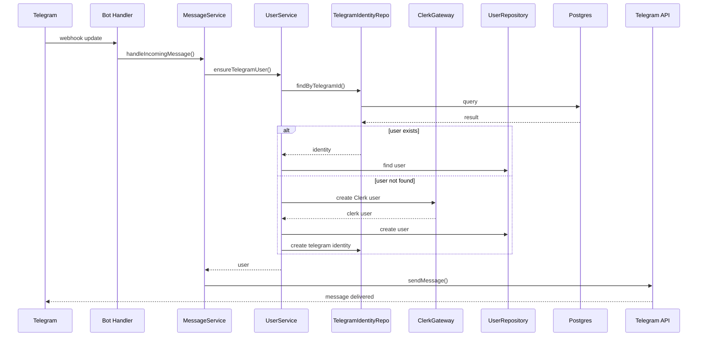

# Telegram Bot + Web App Monorepo — Architecture Spec

## Overview

This project implements a Telegram bot integrated with a web application using a clean layered architecture and a monorepo structure.

The system allows users to interact with the product through:

- Telegram (bot interface)
- Web application (Next.js)

Authentication and identity management are handled by Clerk, with Telegram users mapped to Clerk users through an external identity.

The architecture follows a layered design:

Presentation Layer  
↓  
Service Layer  
↓  
Data Access Layer (DAL) / Gateways  
↓  
Data Sources

This separation ensures:

- clean domain logic
- easy testing
- reusable business logic across bot and web
- infrastructure abstraction

---

# System Architecture

## Layered Architecture

```
+-----------------------+
| Presentation Layer    |
|                       |
| Telegram Bot (Telegraf)
| Web App (Next.js)    |
+-----------------------+
            ↓
+-----------------------+
| Service Layer         |
|                       |
| MessageService        |
| UserService           |
| ConversationService   |
| LinkingService        |
+-----------------------+
            ↓
+-----------------------+
| Data Access Layer     |
| (Repositories + APIs) |
|                       |
| UserRepository        |
| TelegramIdentityRepo  |
| MessageRepository     |
| ConversationRepo      |
|                       |
| ClerkGateway          |
| TelegramGateway       |
+-----------------------+
            ↓
+-----------------------+
| Data Sources          |
|                       |
| Postgres              |
| Clerk API             |
| Telegram API          |
| Queues (optional)     |
+-----------------------+
```

---

# Monorepo Structure

The project uses a Turbo monorepo.

```
apps/
  web/                # Next.js web app
  bot/                # Telegraf Telegram bot

packages/
  services/           # Business logic layer
  dal/                # Repositories + external gateways
  db/                 # Database schema and migrations
  telegram/           # Telegram adapters and helpers
  auth/               # Clerk integration helpers
  shared/             # Shared types, env, schemas
```

---

# Applications

## apps/web

Next.js application.

Responsibilities:

- user dashboard
- account management
- linking Telegram accounts
- Clerk authentication

Tech stack:

- Next.js
- Clerk (@clerk/nextjs)
- shared services

---

## apps/bot

Telegram bot service.

Responsibilities:

- receive Telegram updates
- convert updates into domain commands
- call services
- send replies

Tech stack:

- Telegraf
- Express (for webhooks)
- Clerk backend SDK (@clerk/backend)

Deployment:

- Google Cloud Run
- Telegram webhooks

Local development:

- polling mode

---

# Identity Model

Clerk is the canonical identity provider.

Telegram identities are linked to Clerk users.

Mapping rule:

```
externalId = "telegram:<telegram_user_id>"
```

Database table:

```
telegram_identity
-----------------
telegram_id
user_id
created_at
```

This allows:

- bot usage without browser auth
- web login with Clerk
- unified user identity

---

# Message Processing Flow

Telegram → Bot → Services → DAL

Sequence:

Telegram  
↓  
Telegraf webhook  
↓  
Bot handler  
↓  
MessageService  
↓  
UserService  
↓  
Repositories / Gateways  
↓  
Database / Clerk  

---

## Sequence Diagram



---

# Services

Services orchestrate business logic.

They do not perform database queries directly.

Examples:

- MessageService
- UserService
- ConversationService
- LinkingService

Example:

```ts
async handleIncomingMessage(input) {
  const user = await userService.ensureTelegramUser(input.telegramUser)

  const reply = await router.route({
    userId: user.id,
    text: input.text
  })

  await telegramGateway.sendMessage(input.chatId, reply)
}
```

Responsibilities:

- orchestration
- domain rules
- use cases

---

# Data Access Layer

The DAL handles data persistence and external services.

Two types of components:

## Repositories

Repositories access the database.

Examples:

- UserRepository
- TelegramIdentityRepository
- MessageRepository
- ConversationRepository

Example:

```ts
class TelegramIdentityRepository {
  async findByTelegramId(id: number) {
    return db.telegramIdentity.findUnique({
      where: { telegramId: id }
    })
  }
}
```

---

## Gateways

Gateways interact with external APIs.

Examples:

- ClerkGateway
- TelegramGateway
- QueueGateway

Example:

```ts
class ClerkGateway {
  async createTelegramUser(tgUser) {
    return clerk.users.createUser({
      externalId: `telegram:${tgUser.id}`
    })
  }
}
```

---

# Presentation Layer

Handles transport protocols.

Examples:

- Telegram handlers
- HTTP routes
- Next.js pages

Example:

```ts
bot.on("message", async (ctx) => {
  await messageService.handleIncomingMessage({
    telegramUser: ctx.from,
    chatId: ctx.chat.id,
    text: ctx.message.text
  })
})
```

Responsibilities:

- parse requests
- call services
- return responses

---

# Deployment

## Telegram Bot

Hosted on:

Google Cloud Run

Configuration:

- webhook endpoint
- HTTPS public URL
- Express server

Example:

```
POST /telegram/<secret>
```

Telegram calls this endpoint with updates.

---

## Web App

Hosted on:

Vercel

---

# Local Development

Local bot uses polling mode.

Telegram  
↔ polling  
Local Bot  

Development command:

```
tsx watch src/index.ts
```

Production:

```
build → node dist/index.js
```

---

# Environment Variables

Bot service:

```
TELEGRAM_BOT_TOKEN
CLERK_SECRET_KEY
PUBLIC_URL
WEBHOOK_SECRET
PORT
```

---

# Clerk Integration

Bot uses:

```
@clerk/backend
```

Client creation:

```ts
const clerk = createClerkClient({
  secretKey: process.env.CLERK_SECRET_KEY
})
```

User creation example:

```ts
await clerk.users.createUser({
  externalId: `telegram:${tgUser.id}`,
  privateMetadata: {
    telegramId: tgUser.id
  }
})
```

Important notes:

- emails created via API are automatically verified
- respect Clerk dashboard user requirements

---

# Design Principles

## Strict layering

Presentation  
→ Services  
→ DAL  
→ Data Sources

Services never access the database directly.

---

## Domain-centric services

Business logic lives in services, not handlers.

---

## Infrastructure isolation

External systems are accessed through gateways.

---

## Shared logic

Bot and web app reuse the same services.

---

# Future Extensions

Possible additions:

- conversation state machine
- LLM routing layer
- job queue (Cloud Tasks / PubSub)
- analytics
- rate limiting
- command permissions